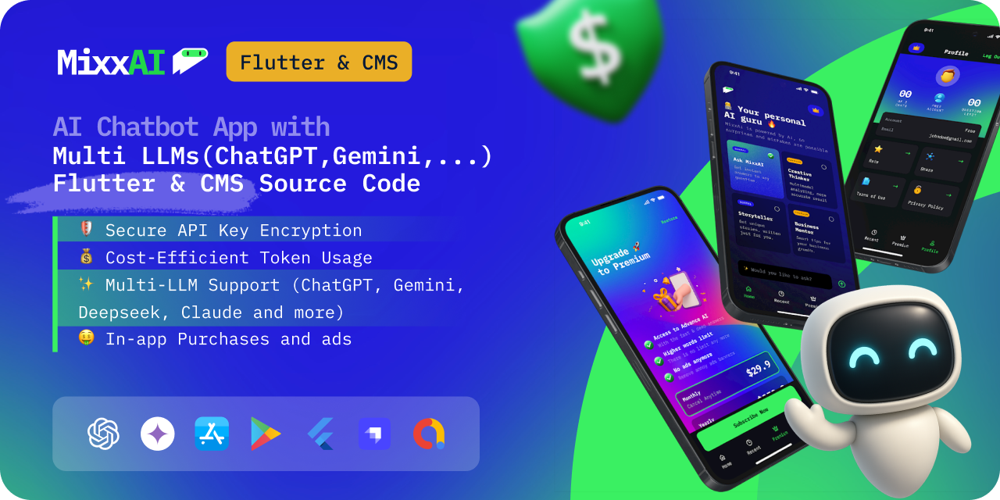
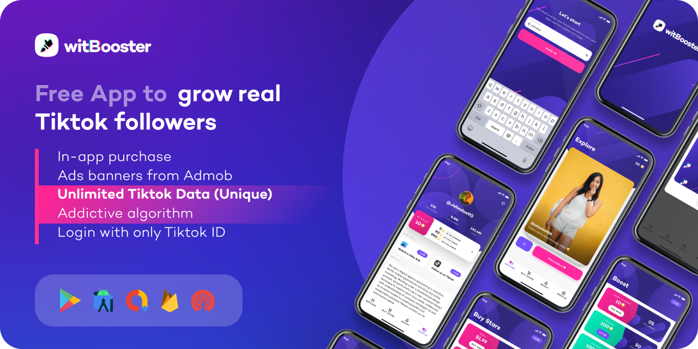

<div align="center">
  
  <h1>MixxAI - Advanced AI Conversation Platform</h1>
  <p>🤖 Powerful | ⚡ Fast | 🔒 Secure | 🌐 Scalable</p>
  
  <p>
    <a href="https://github.com/witwork/mixxai/stargazers">
      
    </a>
    <a href="https://github.com/witwork/mixxai/network/members">
      
    </a>
    <a href="https://github.com/witwork/mixxai/issues">
      
    </a>
    <a href="https://witworkapp.com">
      
    </a>
  </p>
</div>

## 📋 Overview

**MixxAI** is a complete AI conversation platform that lets you seamlessly integrate powerful chatbot capabilities into your applications. Built with performance, security, and scalability in mind, MixxAI helps businesses deliver exceptional conversational experiences.

### Key Features

- ✅ **Multiple AI Models Integration** - OpenAI GPT, Google Gemini, and more
- ✅ **Complete User Management** - Authentication, permissions, and roles
- ✅ **Subscription System** - Apple In-App Purchase support built-in
- ✅ **Conversation History** - Store and analyze all interactions
- ✅ **Enterprise Security** - Data encryption and privacy controls
- ✅ **Easy Deployment** - One-click installation via Docker

## 🚀 Quick Installation

Get your MixxAI server running with our automated installation script:

```bash
wget -O mixxai.sh https://raw.githubusercontent.com/witworkapp/mixxai/main/mixxai.sh && sudo bash mixxai.sh
```

### System Requirements

- **OS**: Ubuntu 24.04 LTS
- **CPU**: 2+ cores recommended
- **RAM**: 1GB minimum (2GB+ recommended)
- **Storage**: 10GB free disk space
- **Privileges**: Root or sudo access
- **Network**: Internet connection

## ⚙️ Manual Installation Options

### Docker Installation

```bash
# Create project directory
mkdir -p ~/mixxai-server && cd ~/mixxai-server

# Create and edit docker-compose.yml and .env files
# Then run:
docker-compose up -d
```

### Source Code Installation

```bash
git clone https://github.com/witwork/mixxai.git
cd mixxai
yarn install
yarn build
yarn start
```

For detailed instructions, see [DETAILED-INSTALLATION.md](DETAILED-INSTALLATION.md).

## 📚 Documentation

- [API Documentation](https://docs.witworkapp.com/mixxai/api)
- [Configuration Guide](https://docs.witworkapp.com/mixxai/config)
- [Integration Examples](https://docs.witworkapp.com/mixxai/examples)
- [Security Best Practices](https://docs.witworkapp.com/mixxai/security)

## 🏢 About WitWork

<div align="center">
  
</div>

WitWork specializes in creating AI-powered solutions and mobile applications that solve real business problems. Our team combines technical expertise with a deep understanding of user experience to deliver products that exceed expectations.

## 🌟 Our Products

<div align="center">
  <table>
    <tr>
      <td align="center" width="50%">
        <br/>
        <h3>WitVPN</h3>
        <p>WitVPN - super fast, secure, stable & free VPN proxy for Android and iOS</p>
        <p>
          <a href="https://codecanyon.net/item/witvpn-super-fast-secure-stable-free-vpn-proxy-for-ios/36750397">iOS App</a> | 
          <a href="https://codecanyon.net/item/witvpn-super-fast-secure-stable-free-vpn-proxy-for-android/28944594">Android App</a>
        </p>
      </td>
      <td align="center" width="50%">
        <br/>
        <h3>StrongVPN</h3>
        <p>StrongVPN - IKEv2 Source Code on Custom VPS for Android and iOS</p>
        <p>
          <a href="https://witworkapp.gumroad.com/l/StrongVPN-IKEv2-Android">Android App</a> | 
          <a href="https://witworkapp.gumroad.com/l/StrongVPN-IKEv2-iOS">iOS App</a>
        </p>
      </td>
    </tr>
    <tr>
      <td align="center" width="50%">
        <br/>
        <h3>MixxAI</h3>
        <p>Advanced AI Conversation Platform</p>
        <p>
          <a href="https://github.com/witwork/mixxai">GitHub Repo</a>
        </p>
      </td>
      <td align="center" width="50%">
        <br/>
        <h3>WitBooster</h3>
        <p>TikTok Followers Growth Tool</p>
        <p>
          <a href="https://codecanyon.net/item/witbooster-free-app-to-grow-real-tiktok-video-followers-for-android/29953109">Android App</a>
        </p>
      </td>
    </tr>
  </table>
</div>

## 📞 Contact & Support

<div align="center">
  <h3>🌐 Follow Us</h3>
  <p>
    <a href="https://witworkapp.com">
      
    </a>
    <a href="mailto:hello@witworkapp.com">
      
    </a>
  </p>
  
  <h3>🔗 Social Media</h3>
  <p>
    <a href="https://www.facebook.com/witworkapp">
      
    </a>
    <a href="https://www.instagram.com/witworkapp/">
      
    </a>
    <a href="https://twitter.com/witworkapp">
      
    </a>
  </p>
  <p>
    <a href="https://www.tiktok.com/@wit_work_app">
      
    </a>
    <a href="https://www.threads.com/@witworkapp">
      
    </a>
  </p>
  
  <h3>👩‍💻 Developer Platforms</h3>
  <p>
    <a href="https://github.com/witworkapp">
      
    </a>
    <a href="https://dribbble.com/WitWorkApp">
      
    </a>
  </p>
  
  <h3>🛒 Marketplaces</h3>
  <p>
    <a href="https://codecanyon.net/user/witworkapp/portfolio">
      
    </a>
    <a href="https://witworkapp.gumroad.com/">
      
    </a>
  </p>
</div>

## 📄 License

MixxAI is available under the MIT License. See the [LICENSE](LICENSE) file for more information.

---

<div align="center">
  <p>© 2024 WitWork. All rights reserved.</p>
  <p>
    <a href="https://witworkapp.com/privacy">Privacy Policy</a> | 
    <a href="https://witworkapp.com/terms">Terms of Service</a>
  </p>
</div>